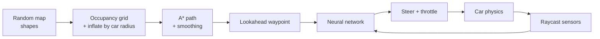

# Neural Driver Roadmap: A\* plans, neural net drives

Sep 26, 2026 · @Shiv

## Goal and architecture

A car drives through a randomly generated map of fake gullies and passages. **A\* plans** the optimal route, and a **neural network drives** it without crashing, including on maps it has never seen. Plan for 14–16 weekends (about 3.5 months, 70–90 hours at 5–6 hours per weekend), and write the core logic (A\*, the neural network, the genetic algorithm) yourself.

- **Global planner (A\*):** knows the whole map and decides *where* to go.
- **Local driver (neural network):** sees only its sensors and the next waypoint, and decides *how* to steer. This split is how real autonomous vehicles are built: a planner plus a controller.

### Design decisions

| Area | Decision | Why |
| --- | --- | --- |
| Stack | All Python: Pygame for simulation and drawing, NumPy for sensors, network and genetic algorithm, Matplotlib for charts, pytest for tests | Python is what AI/ML reviewers expect; one language end to end; the same environment plugs into Gymnasium for PPO |
| Map | Random seeded maps with fake gullies (dead ends) and passages; grid walls first, then smooth roads of varying width | Gullies punish a greedy driver and make the A\* route matter |
| Planning | A\* on an occupancy grid, obstacles inflated by the car's radius, path smoothed | A\* needs a graph; the grid turns any shape into one |
| Driving | From-scratch MLP; inputs = 7 rays + speed + lookahead waypoint | The network follows the route locally and never sees the whole map |
| Training | Neuroevolution (genetic algorithm), new random map every generation | No labelled data needed; avoids memorizing one map |
| Fitness | Progress along the A\* path, goal bonus, crash and idle penalties | A\* defines what progress means |
| Scope | Weekends only, 3–4 months; this is the only side project | Focus over breadth |

## Phase 1: Map, car and sensors (6–8 hours)

Finish when you can drive the car with the arrow keys on a fresh random map, and it stops when it hits a wall.

- [ ] Stack: Python 3.11+, Pygame for the window and drawing, NumPy for the maths. Keep the simulation (env/) separate from the drawing (viz/) so training can run headless at full speed, and give the environment a Gymnasium-style reset() / step() API
- [ ] Map generator v1: a grid filled with random walls, keeping only maps where start and goal are connected (check with BFS)
- [ ] Map generator v2: random polygons and circles as obstacles with a seeded random generator, including fake gullies (dead ends that tempt the car off the route), plus a UI where the user can draw their own road blocks
- [ ] Car physics: position, angle, speed, acceleration, friction, and a steering limit that shrinks at high speed
- [ ] Collision: the car is a rectangle, and it crashes if any edge crosses a wall (line–segment intersection)
- [ ] Sensors: 5–7 rays spread over about 120°, each returning distance to the nearest wall scaled to 0–1. Draw them on screen

## Phase 2: A\* on random shapes (6–8 hours)

Finish when a smooth, drivable path appears from start to goal on any random map, or the map is rejected as unsolvable. A\* works on any graph, so the job here is turning the random shapes into one.

- [ ] Watch Sebastian Lague's A\* episode 1 and trace A\* on paper on a 5×5 grid first
- [ ] **Occupancy grid:** sample the map into small cells (about 4–5 px each), free or blocked
- [ ] **Inflate obstacles** by the car's half-width plus a safety margin, so the path never goes through a gap the car can't fit through
- [ ] Write A\* yourself: 8 neighbours, diagonal cost √2, octile-distance heuristic, and heapq for the priority queue
- [ ] **Smooth the path:** remove any waypoint that has a clear line of sight to the one after it, then round the corners (Chaikin or a spline)
- [ ] Show the explored cells and the final path, and compare A\* with Dijkstra (nodes explored, time)
- [ ] Stretch goal: a visibility graph or Hybrid A\* that respects the car's turning radius

## Phase 3: Neural driver + neuroevolution (8–10 hours)

Finish when a population of about 200 cars learns, within 50 generations, to follow the A\* path to the goal without crashing.

- [ ] **Inputs (about 10):** 7 ray distances, speed, and the angle and distance to a lookahead point about 50 px ahead on the A\* path
- [ ] **Network:** a multi-layer perceptron (10 → 12 → 4) written from scratch in NumPy: weights, biases, tanh or ReLU, forward pass only
- [ ] **Outputs:** steer left, steer right, throttle, brake (or 2 continuous outputs: steering and throttle)
- [ ] **Fitness** = progress along the A\* path (the index of the nearest waypoint reached) + a bonus for reaching the goal − a penalty for crashing or being slow. Kill cars that stop making progress for 3 seconds
- [ ] **Genetic algorithm:** keep the top 10% (elitism), mutate weights with Gaussian noise (rate about 0.1), optionally add crossover
- [ ] Save and load the best network as a NumPy .npz file
- [ ] Plot best and average fitness per generation

The trap to avoid: training on one map means it memorizes that map. Use a new random map every generation, or score each car on 3 maps at once.

## Phase 4: Unseen maps and benchmark (8–10 hours)

Finish when you can say, with numbers, how well the trained driver handles 100 maps it has never seen.

- [ ] Replace the grid walls with smooth roads of varying width (well above the car's width) made from random splines, plus dead-end gullies as traps
- [ ] Keep a fixed test set of 100 seeded maps that are never used for training
- [ ] Measure success rate, crash rate, average time to goal, and how far the car strays from the A\* path
- [ ] Baseline: a hand-written pure-pursuit controller following the same A\* path. Does the neural network beat it?
- [ ] Ablation: remove the waypoint inputs and train again. How much does A\* guidance help?
- [ ] Stretch goal: register the simulator as a Gymnasium environment, train with PPO (Stable-Baselines3), and compare it with neuroevolution on the same test set

## Phase 5: Portfolio polish (4–5 hours)

Finish when a recruiter can open a link, draw a map and watch your car drive it in under a minute.

- [ ] Publish a browser build with pygbag (Pygame compiled to WebAssembly) on GitHub Pages or itch.io with a "Draw map", "Plan (A\*)" and "Drive" flow, plus a pretrained model
- [ ] README with a GIF at the top, the architecture diagram, the results table and the learning curve
- [ ] Short write-up or LinkedIn post: "A\* plans, a neural net drives: X% success on 100 unseen maps"
- [ ] Resume line with numbers, for example "Neuroevolved driving policy reached 92% success on unseen procedurally generated maps"
- [ ] Credit the tutorials you learned from

## Timeline and resources

| Weekends | Phase | Milestone at the end |
| --- | --- | --- |
| 1–2 | Phase 1 | Python project + Pygame window set up; car physics; drive with the arrow keys |
| 3–4 | Phase 1 | Random grid maps, then random shapes with gullies; collisions; raycast sensors drawn on screen |
| 5–6 | Phase 2 | A\* on the occupancy grid with inflation and smoothing; explored cells visualized |
| 7–9 | Phase 3 | Neural network + genetic algorithm; cars learn to follow the A\* path on one map |
| 10–11 | Phase 3–4 | Training on a new random map each generation; smooth variable-width roads |
| 12–13 | Phase 4 | 100-map test set, pure-pursuit baseline, ablation results |
| 14 | Buffer | Catch up on slipped work, or start the PPO stretch goal |
| 15–16 | Phase 5 | Deployed demo, README with GIF and results, LinkedIn post |

This assumes 5–6 focused hours a weekend. Phase 3 (fitness tuning) is the most likely to slip, and the weekend-14 buffer is there to absorb that.

Resources:

- Radu Mariescu-Istodor, "Self-Driving Car with JavaScript" course (freeCodeCamp YouTube channel): car physics, sensors, neural network and genetic training with no libraries. This is the closest match to Phases 1 and 3
- Sebastian Lague, "A\* Pathfinding" series (YouTube): concepts for Phase 2
- [Sebastian Lague's neural network video](https://youtu.be/hfMk-kjRv4c): how neural networks work from scratch
- [The Coding Train: A\* challenge](https://thecodingtrain.com/challenges/51-a-pathfinding-algorithm/): A\* in JavaScript
- [Tech With Tim: A\* visualization](https://www.youtube.com/watch?v=m8u533opxpM): A\* in Python
  - Stable-Baselines3 + Gymnasium docs: only for the PPO stretch goal
